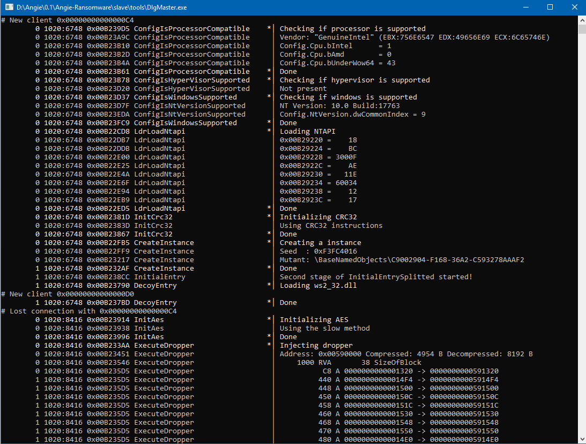
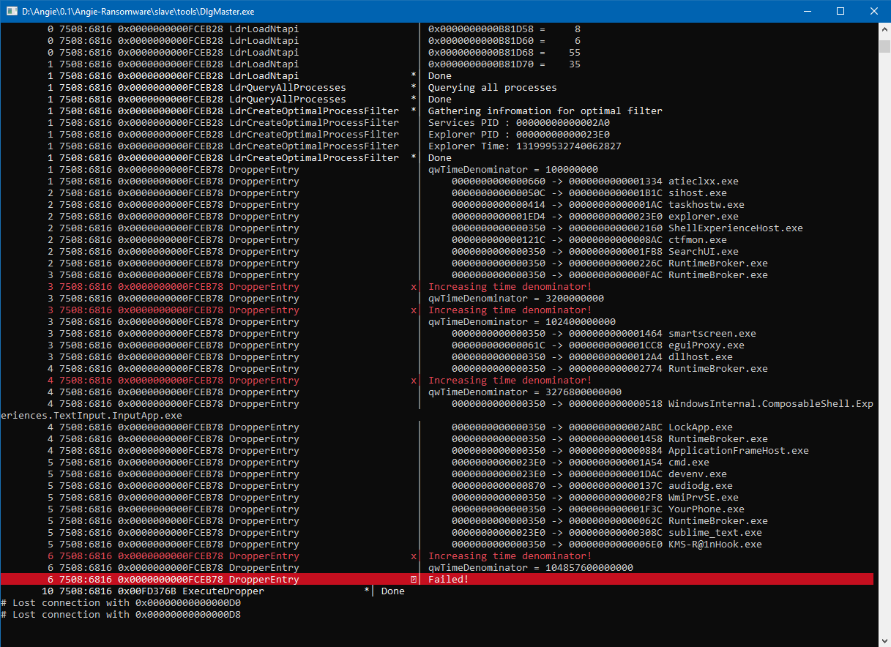

# Angie-Ransomware

Professional ransomware for educational purposes   
Angie-Ransomware is x32 bit ransomware that is designed to target mainly x64 Windows but still supports x32 bit of course, She by design can bypass almost all sandboxes by using its own NTDLL stubs from Windows 7 to Windows 10 1809, if the version of windows is newer than Windows 10 1809 will load the addressed from NTDLL.DLL and use them. Another trick that she does is if she is under Wow64 after connecting to master and retrieves a encryption key, she will switch to long mode and operate on x64 user space, this switch is the killer for almost all sandboxes and debuggers and its the biggest defence.
Its still under development.

### Tools
Visual Studio 2017/2019   
Intel System Studio 19.0   
Windows SDK 10.0.17763.0   
Sysinternals Suite   
Make from Mingw   
Nasm   

### Cool people
http://sandpile.org

### Some images

